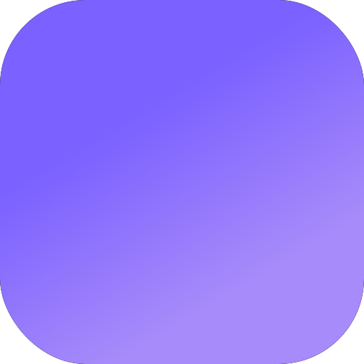
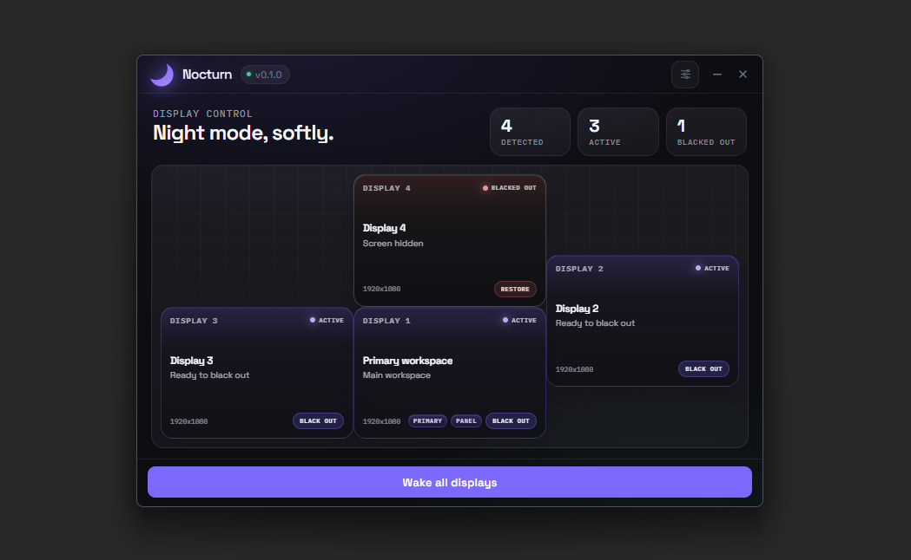

  

<h1 align="center">Nocturn</h1>

  Darken one or more screens instantly, without disturbing the rest of your setup.

  
  
  

  

> Made for night setups, focus sessions, and multi-screen desks where one monitor can quickly become too much light.

## What Nocturn Is

Nocturn is a small Windows app that lets you turn selected screens fully dark in a second, while keeping the rest of your desktop usable.

It is built for people who want more control over their workspace at night, during focused work, or whenever an extra monitor becomes distracting.

## Why People Use It

- A side monitor is lighting up the whole room at night.
- You want fewer visual distractions without changing your setup.
- You want to keep one screen active and quiet the others.
- You need a fast way to hide and restore screens whenever you want.

## What You Can Do

- Darken one screen or several at once.
- Keep your main screen available.
- Bring every screen back instantly.
- Use a compact control panel instead of digging through system settings.
- Keep your preferences from one session to the next.

## Product Direction

Nocturn is designed to feel simple, immediate, and calm.

The goal is not to manage your whole desktop. The goal is to give you one clean action: make unwanted screens disappear, then bring them back just as fast.

## Current State

- Windows only
- Early public version
- Focused on the core experience first

## Download

Get the latest Windows installer from GitHub Releases.

## Documentation

If you want more context on the product vision and upcoming direction, the main notes live in `docs/`.
